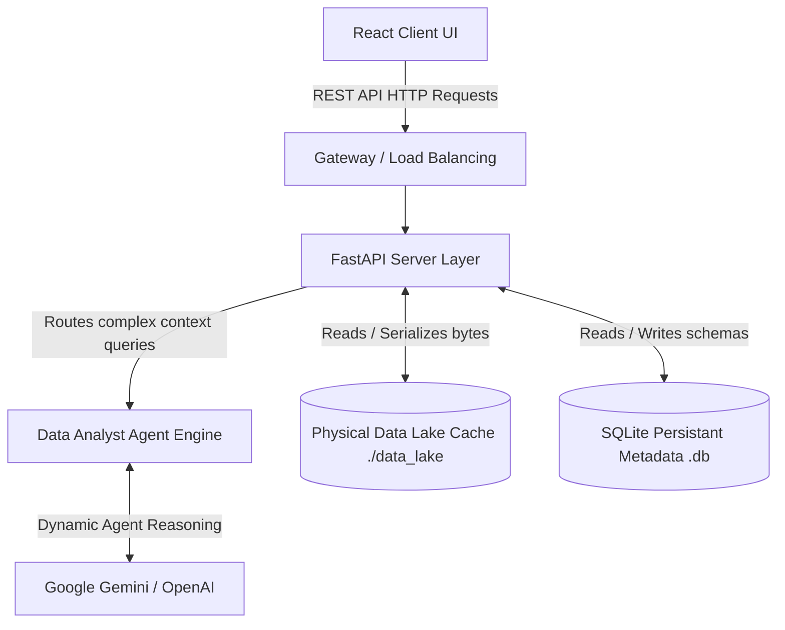
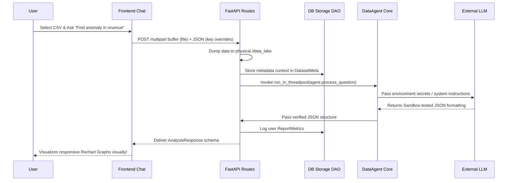
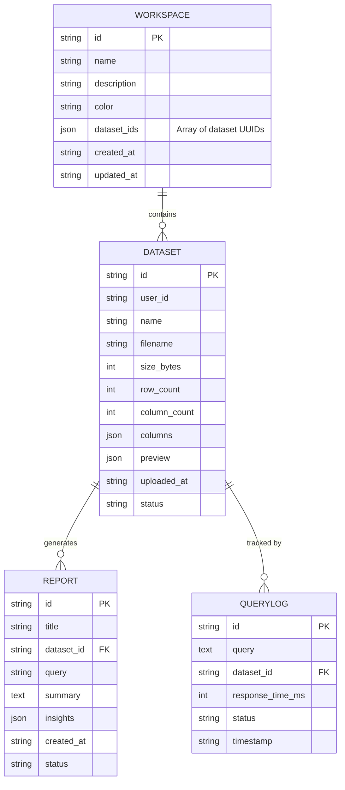

# Architecture & Implementation

**Live Portal:** [https://data-analyst-depth.vercel.app/](https://data-analyst-depth.vercel.app/)

This document covers the core architecture, data pipelines, and relationship databases utilized inside Data Analyst Depth (DAD).

## 1. System Context Architecture
The platform is built on an isolated, containerable micro-architecture with the frontend decoupled natively from the FastAPI engine, communicating exclusively over pure JSON and Multipart arrays.

---

## 2. Data Flow Diagram (DFD)
Whenever a user uploads a file with a question via the Workspace UI, it triggers the analytical processing engine pipeline. Massive scale logic is dumped internally into background `asyncio` threadpools to decouple logic blocking.

---

## 3. Database Schema (Entity Relationship Diagram - ERD)
We map all models natively using `SQLAlchemy`.

